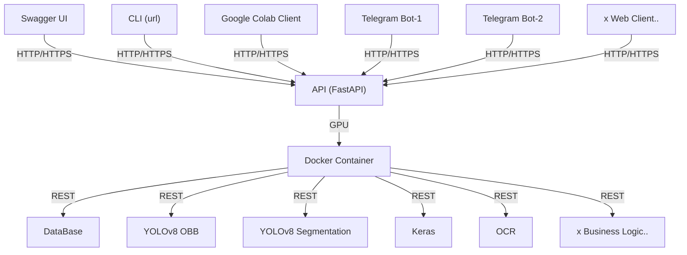

### Новые модели YOLOv8 на DataSet-3
- **[💾 Medium 1280 200 эпох](https://drive.google.com/drive/folders/1Mp-tKrQd7t1gGNwS4wPjV968LLFWP-Z7?usp=sharing)**
- **[💾 Medium 1440 250 эпох](https://drive.google.com/drive/folders/1SBrDqFHxCpZwFpPm_k5y1ZEycn6L4AWm?usp=sharing)**
- **[💾 Small 1280 150 эпох](https://drive.google.com/drive/folders/1e3ZTxoIRzqvOHGRfhUvR_ZjQ-6hm-Fqj?usp=sharing)**

### Итоговый дополнительный ДатаСет для Обучения YOLOv8 на дату 06.12.2023

**[📸 NewCountersDataSet 06.12.2023 ](https://drive.google.com/file/d/1rxSGicbctboRUbIGiCc01n3YcQcowzcf/view?usp=sharing)**

---

<h4>Старые ссылки на первые части набираемого ДатаСета:</h4>

<li>[DataSet-2 на 23.11.2023](https://drive.google.com/file/d/1I5DnyJalB5gC3_YY4ewWiugeCcaoFZtH/view?usp=sharing)</li>
<li>[DataSet-3 на 30.11.2023](https://drive.google.com/file/d/1upGKclAteu1MpEzLqbaGvmtTPIbS3oYm/view?usp=sharing)</li>

---
### Сравнение моделей YOLOv8 [Оптимальный вариант 09: cds2_s-seg_1280_100e.pt]

**[⚛️ cds2_s-seg_1280_100e.pt](https://drive.google.com/file/d/1BH3Gta5PLvJOkSwIEin8cvA9CAmlTVCC/view?usp=sharing)**

**[💾 Обученные Модели YOLOv8 на Google Drive (+Train.Logs) 💾](https://drive.google.com/drive/folders/1CqJ_nz3k6bfvA76meVZIVpBoR0s3QNeW?usp=sharing)**

---

---

### Предлагаемая схема развития проекта

### Пример результата работы YOLOv8 (первые тесты)

<h4>TRAIN-1</h4>

<h4>TRAIN-2</h4>

---

<h2>✅ Отчет</h2>

<h3>📆 неделя 05.09-12.09</h3>
<li>1. Изучение ТЗ и ДатаСета заказчика</li>
<li>2. Обдумывание способов разработки решения с учетом ТЗ</li>
	
<h3>📆 неделя 12.09-19.09</h3>
<li>1. Изучение популярных open source инструментов для разметки Датасетов</li>
<li>2. Продолжение изучения материалов на портале УИИ по обнаружению объектов</li>

<h3>📆 неделя 19.09-26.09</h3>
<li>1. Разметка изображений в приложении CVAT</li> 

<h3>📆 неделя 26.09-03.09</h3>
<li>1. Окончание и проверка разметки части ДатаСета [16]</li>
<li>2. Изучение форматов аннотаций CVAT, Pascal, YOLO, COCO</li>
<li>3. Первые пробы обучения YOLOv8 на малом ДатаСете</li>

---

<h3>💾 ТЗ на проект "Распознавание показаний счётчиков и серийных номеров"</h3>

<li>1. Введение Целью данного проекта является разработка системы для распознавания показаний счётчиков различных видов и серийных номеров этих счётчиков с использованием фотографий, полученных через Telegram Bot. Распознанные данные будут отправляться обратно пользователю,сверятся о отправляться в базу данных.</li> 
	
<h4>2. Основные требования</h4>
<li>Разработать модель машинного обучения для распознавания показаний счётчиков и серийных номеров на фотографиях.
Создать Telegram Bot, интегрированный с моделью распознавания.</li>
<li>Бот должен быть способен обрабатывать фотографии счётчиков и извлекать из них числовые показания и серийные номера.
Проект должен быть способен работать с различными типами счётчиков и разными структурами серийных номеров.</li> 

<h4>3. Описание процесса</h4>
<li>Пользователь делает фотографию счётчика с помощью смартфона и отправляет ее через Telegram Bot.</li>
<li>Telegram Bot получает фотографию и передает её на обработку модели распознавания.</li>
<li>Модель анализирует фотографию, извлекает числовые показания и серийный номер счётчика.</li>
<li>Полученные данные (показания и серийный номер) отправляются обратно пользователю через Telegram Bot.</li>
<li>Пользователь сверяет распознанные показания с реальными при необходимости корректирует.</li>
<li>Показания заносятся в базу данных с выгрузкой в файл.</li> 

<h4>4. Требования к модели распознавания</h4>
<li>Модель должна быть обучена на достаточно большом и разнообразном датасете, чтобы достичь точности не менее 98%.</li>
<li>Модель должна поддерживать работу с различными структурами показаний счётчиков и серийных номеров.</li>
<li>Возможность переобучения модели на новых данных для улучшения качества распознавания.</li> 

<h4>5. Требования к Telegram Bot</h4>
<li>Создать Telegram Bot, который будет интегрирован с моделью распознавания.</li>
<li>Бот должен уметь принимать фотографии от пользователей и передавать их на обработку модели.</li>
<li>После обработки моделью, бот должен отправить результаты (показания и серийный номер) пользователю.</li>
<li>Принимать скорректированные показания и вносить их в базу.</li> 

<h4>6. Интеграция и развертывание</h4>
<li>Развернуть удаленный сервер для обработки фотографий и запуска модели распознавания.</li>
<li>Интегрировать модель и Telegram Bot на сервере для автоматической обработки запросов.</li> 

<h4>Важное дополнение к техническому заданию</h4>
<li>1)	Предоставленного объема датасета не достаточно для достижения указанной точности в 98%. Также в датасете имеется малое количество фотографий счетчиков одного типа что не позволит обучить модель на для позиционирование серийного номера и показаний прибора. </li>
<li>2)	Нужна будет сборка сервера или аренда для работы бота.</li> 

---

<h3>Ссылки</h3>

<li><strong><a href="">Google Colab Notebook</a></strong></li> 

